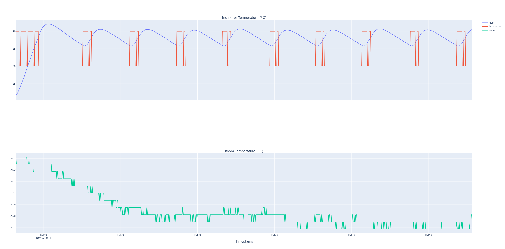

# Experiment 

## Goal 

Calibration of plant models with an empty system. Closed lid.

## Author

Claudio Gomes

## Configuration

### Hardware

The current configuration as of the time of commit is used.

### Software 

**_TODO: Add controller configuration._**

## Experiment Log and CSVs
- [20241106_calibration_empty_system.csv](20241106_calibration_empty_system.csv): the dataset.

## Results and Discussion

Open the [interactive plot](./results.html)

